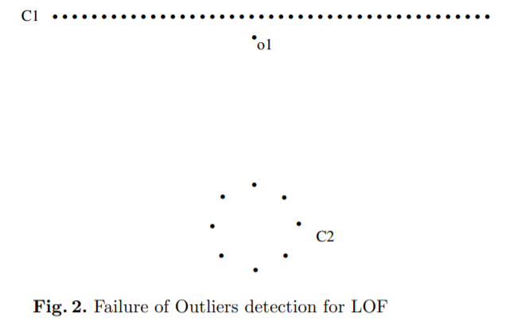
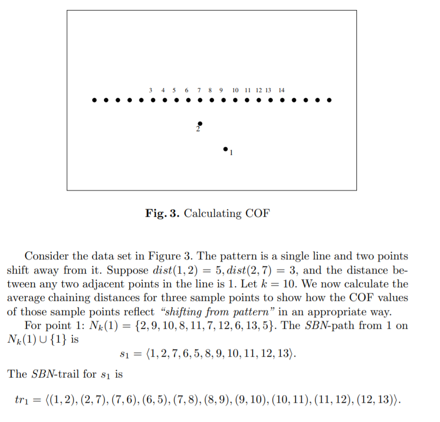
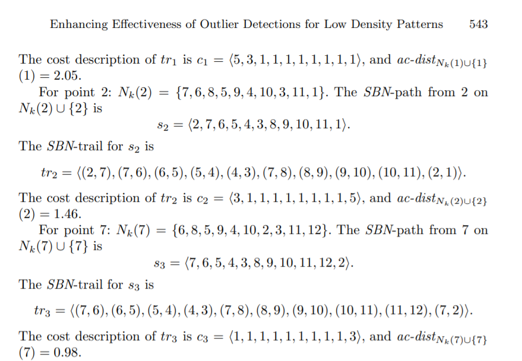
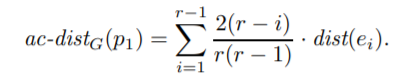

<body>
<br>

The primary problem with LOF is that it is density oriented, thus it is unable to identify structural anomalies such as in the image above<br>

In order to solve this problem the authors of the <a href="https://link.springer.com/chapter/10.1007/3-540-47887-6_53">COF</a> came up with the idea of different distance measure for LOF<br>

The logic of the algorithm is the following, instead of measuring the euclidean distance between the points to get the k-neighbors like in LOF, we need to measure the distance in the following manner. For the first closest point of the current point add them in the neighborhood, for others measure distance between the closest point in the neiborhood and accordingly add the closest points to the neihborhood. This way the points that are closest to the neighborhood are added which helps to preserve the structural form of the data.
<br><br>
Here is an example to better illustrate the concept <br>
<br>
<br>
Note: here COF distance is defined as <br>
where r is the length of the trail, e1 is the trail, and dist is the abovementioned distance.
</body>
```python
from pyod.utils.data import generate_data
from sklearn.utils import shuffle
from sklearn.metrics import mean_squared_error
import numpy as np
import matplotlib.pyplot as plt
from pyod.models.cof import COF


x_train,y_train,x_test,y_test = generate_data(n_train=1000,n_test=1000,n_features=2,contamination=0.1)
x_train,y_train=shuffle(x_train,y_train,random_state=42)
x_test,y_test=shuffle(x_test,y_test,random_state=42)

y_pred = COF(n_neighbors=200,contamination=0.1).fit_predict(x_train)

plt.figure(1)
plt.scatter(x_train[:,0],x_train[:,1],c=y_pred)
plt.figure(2)
plt.scatter(x_train[:,0],x_train[:,1],c=y_train)
plt.show()
```