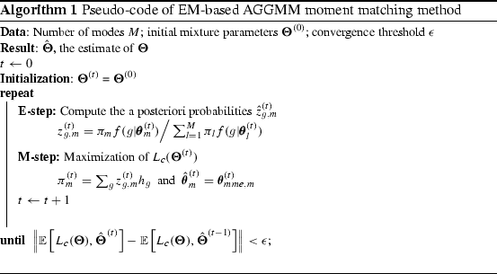

<script src="https://polyfill.io/v3/polyfill.min.js?features=es6"></script>
<script type="text/javascript" id="MathJax-script" async
  src="https://cdn.jsdelivr.net/npm/mathjax@3/es5/tex-chtml.js">
</script>

<body>

The need for Gaussian Mixture Models comes from the limitations of Kmeans.<br>
The core problem with Kmeans is that it does not work well with non-spherical data distributions<br>
<br>

The idea behind the gaussian mixture models is to simultaneusly fit multiple gaussian distributions to the dataset such that each of them maximizes the probability of the cluster being generated from the give gaussian distribtuions<br>
The problem here is that the maximum likelyhood estimation cannot be applied to multiple gaussian distributions, thus to estimate the parameters the algorithm has to utlize expectation maximization algorithm to obtain the distribution parameters.
</body>

```python
from sklearn.datasets import make_blobs
from sklearn.mixture import GaussianMixture
import matplotlib.pyplot as plt
x, y = make_blobs(n_samples=1000, centers=3,
                       cluster_std=[1,1.4,0.5], random_state=170)
y_pred=GaussianMixture(n_components=3,random_state=42).fit_predict(x)
plt.scatter(x[:,0],x[:,1],c=y_pred)
plt.show()
```