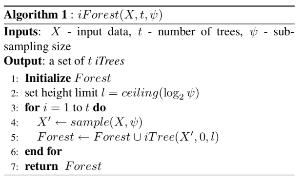
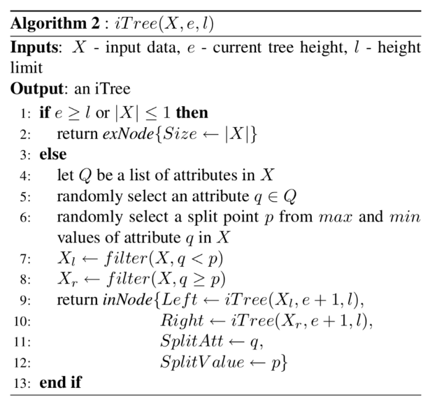
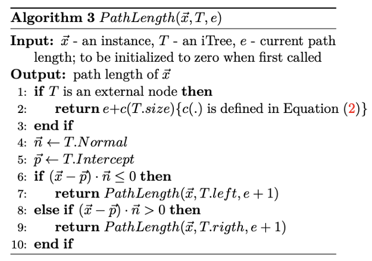
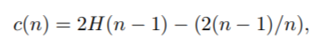
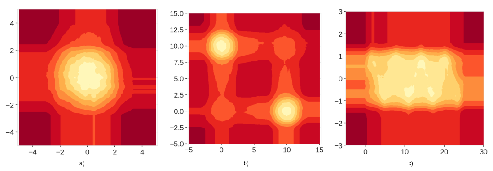
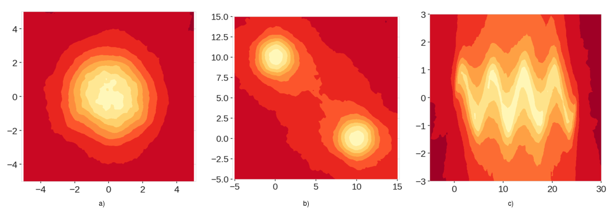
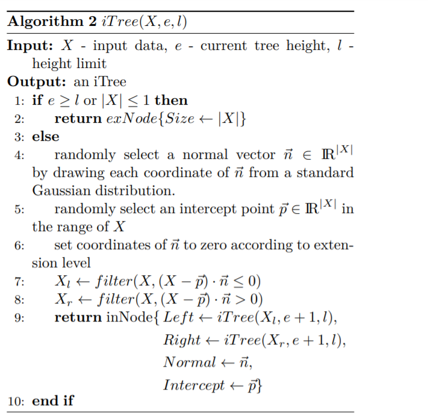

<script src="https://polyfill.io/v3/polyfill.min.js?features=es6"></script>
<script type="text/javascript" id="MathJax-script" async
  src="https://cdn.jsdelivr.net/npm/mathjax@3/es5/tex-chtml.js">
</script>


<body>


The original source of the algorithm is the paper by Liu et al. https://ieeexplore.ieee.org/document/4781136<br>

<br>

The algorithm defining the forest of isolation trees has the following steps.<br>
<br><br>
<bold>Step 1:</bold> Define height limit as $$ceiling(\log_2^\phi)$$<br>
<bold>Step 2:</bold> At each iteration take a random sample from the input dataset to train a single isolation Tree:<br>
<bold>Step 3:</bold> Train a single isolation tree on the random sample<br>
<bold>Step 4:</bold> return average path length for a single datapoint<br>
Now let us discuss how each individual tree is built.

<br>

<bold>Step 1:</bold> randomly select an attribute q from the provided input data<br>
<bold>Step 2:</bold> randomly select a split point p from min to max of the attribute q<br>
<bold>Step 3:</bold> If only single datapoint is left return <br>
<bold>Step 3:</bold> repeat steps 2 and 3 untill all the datapoints are separated by the tree<br>

An intuitive question might arise. How do one evaluate the model on test data after training the isolation forest.<br>

<br>

<bold>Step 1:</bold> iterate over all datapoints in the given evaluation input<br>
<bold>Step 2:</bold> For each datapoint calculate the Pathlength of the single datapoint by calculating number of edges from the root node to the terminating node containing the datapoing<br>

Here an important remarks is that if the datapoint terminates at external node with the size>1 then the c(Size) therm is added to the path lenght as a row estimation for the missing edges to the terminating node. The formula of c is the following.<br>

<br>

However the isolation forest algorithm has been shown to contain bias.<br>

<br>

As you can see in the images, isolation forest algorithm has generated low anomaly regions around the data points that should have been equal to the scores of everywhere else outside of the data range <br>

The enxtended isolation forest algorithm has come to the place of it's successor to solve the abovementioned problem.<br>

<br>

As you can see in the score maps generated by the extended isolation forest there are no extraneous low anomaly regious.

<br>

The primary difference between IF and EIF is in the way of separating the datapoints.<br>
In case of extended isolation forest, the separation is done by randomly selecting a normal vector, with a random slope and slicing the input data with the given random vector.<br>

The EIF had better results in the following comparison benchmark


</body>

```python
from pyod.utils.data import generate_data
from sklearn.utils import shuffle
from sklearn.ensemble import IsolationForest
from sklearn.metrics import mean_squared_error
import eif as iso
import numpy as np
import matplotlib.pyplot as plt

x_train,y_train,x_test,y_test = generate_data(n_train=10000,n_test=10000,n_features=3,contamination=0.1)


x_train,y_train=shuffle(x_train,y_train,random_state=42)
x_test,y_test=shuffle(x_test,y_test,random_state=42)

eif=iso.iForest(x_train,ntrees=100,sample_size=256,ExtensionLevel=1)
IF=IsolationForest(random_state=42,contamination=0.1,n_estimators=100)

x_train,y_train,x_test,y_test = generate_data(n_train=10000,n_test=10000,n_features=3,contamination=0.1) # generate anomalous data points

x_train,y_train=shuffle(x_train,y_train,random_state=42)
x_test,y_test=shuffle(x_test,y_test,random_state=42)

eif=iso.iForest(x_train,ntrees=100,sample_size=512,ExtensionLevel=1)
IF=IsolationForest(random_state=42,contamination=0.1,n_estimators=100).fit(x_train)

# Converting the anolmaly scores to anomaly prediction by taking 1-contamination as a treshold
y_pred=np.where(eif.compute_paths(X_in=x_test)<np.percentile(eif.compute_paths(X_in=x_test),90),0,1)
y_pred_IF=IF.predict(x_test)

y_pred_IF = np.where(y_pred_IF==1,0,1) # making prediction formats the same


print(mean_squared_error(y_test,y_pred),mean_squared_error(y_test,y_pred_IF))
```
Output: 0.0088, 0.0093