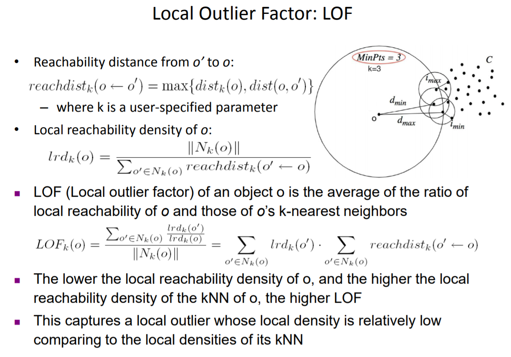

<script src="https://polyfill.io/v3/polyfill.min.js?features=es6"></script>
<script type="text/javascript" id="MathJax-script" async
  src="https://cdn.jsdelivr.net/npm/mathjax@3/es5/tex-chtml.js">
</script>

<body>



The intuitive understanding of the algorithm is to give density estimate to each neighborhoods of each elements, and those elements that have lower density should be considered anomalies.<br><br>

The first step in the algorithm is to calculate local reachability desnity of all datapoints. The lrd is defined as the number of elements in the neighborhood of d divided by reachability distance of all neighboring points from d.<br><br>

The actual calculationg of local outlier factor is the following. Sum of all lrd of all neighboring points divided by the lrd of the current point. The sum is finally normalized by dividing by the number of elements in the neighborhood of current point.<br><br>

IF LOF = 1 then the points have the same desnity as the neighbors<br><br>
IF LOF < 1 then the point has higher density than neighbors<br><br>
IF LOF > 1 then the points have lower desnity than neighbors thus can be considered an outlier.
</body>
```python
from pyod.utils.data import generate_data
from sklearn.utils import shuffle
from sklearn.metrics import mean_squared_error
import numpy as np
import matplotlib.pyplot as plt
from sklearn.neighbors import LocalOutlierFactor

x_train,y_train,x_test,y_test = generate_data(n_train=10000,n_test=10000,n_features=2,contamination=0.1)


x_train,y_train=shuffle(x_train,y_train,random_state=42)
x_test,y_test=shuffle(x_test,y_test,random_state=42)
y_pred = LocalOutlierFactor(n_neighbors=4).fit_predict(x_train)
y_pred = np.where(y_pred==1, 0, 1)
print(mean_squared_error(y_train,y_pred))
plt.figure(1)
plt.scatter(x_train[:,0],x_train[:,1],c=y_pred)
plt.figure(2)
plt.scatter(x_train[:,0],x_train[:,1],c=y_train)
plt.show()
```