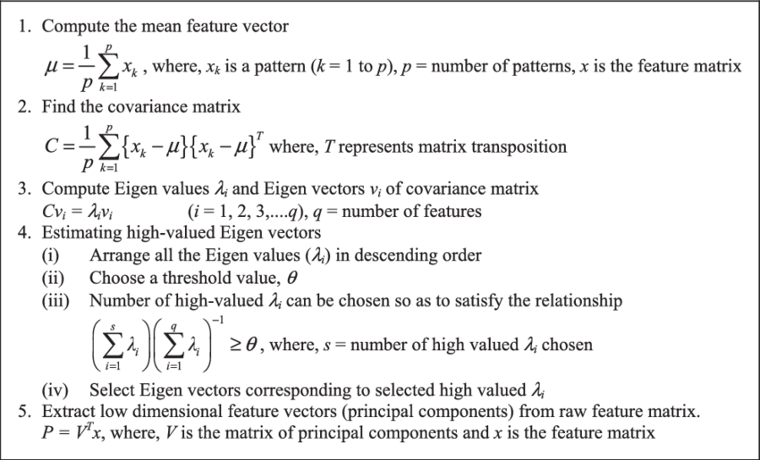
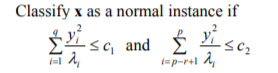

<body>

Principal component analysis (PCA) is the process of computing the principal components and using them to perform a change of basis on the data, sometimes using only the first few principal components and ignoring the rest. 

The logic behind the algorithm is to approximate the current data with lower dimensional principal component representation 
<bold>Step 1:<bold> Calculate the convariance or correlation matrix with the corresponding eigenvectors and eigenvalues 
<bold>Step 2:<bold> Sort eigenvectors based on their eigenvalues and in case of dimenisonality reduction drop some of them 
<bold>Step 3:<bold> Approximate the dataset by the product of the eingenvectors and the original dataset 

Now here comes an intuitive question how can PCA be used for anomaly detection 

The PCC(principal component classifier) has been first described by Ling et al. in the <a href="http://citeseerx.ist.psu.edu/viewdoc/download?doi=10.1.1.66.299&rep=rep1&type=pdf">paper</a> 

let us denote yi is the ith principal component of that is equal to ei(x-mean) where ei is the ith eigenvector. 
 
Otherwise classify the instance as an anomayl. 
The intuition for the formula is following. The formula gives approximation of mahalanobis distance between the point and principal components. Thus the first sum is the distance between the point and the chosen K principal components which shows whether the given point conforms to the structure of the data. The second sum is the distance between the point and the not chosen n-K components which shows how close the given point which helps to detect the extreme value anomalies. 

</body>