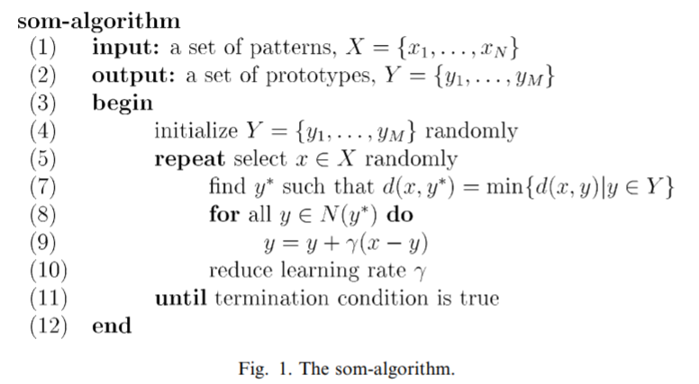
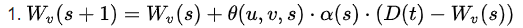
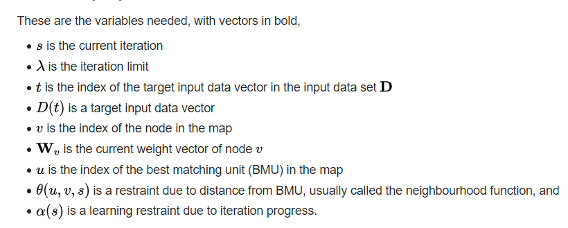
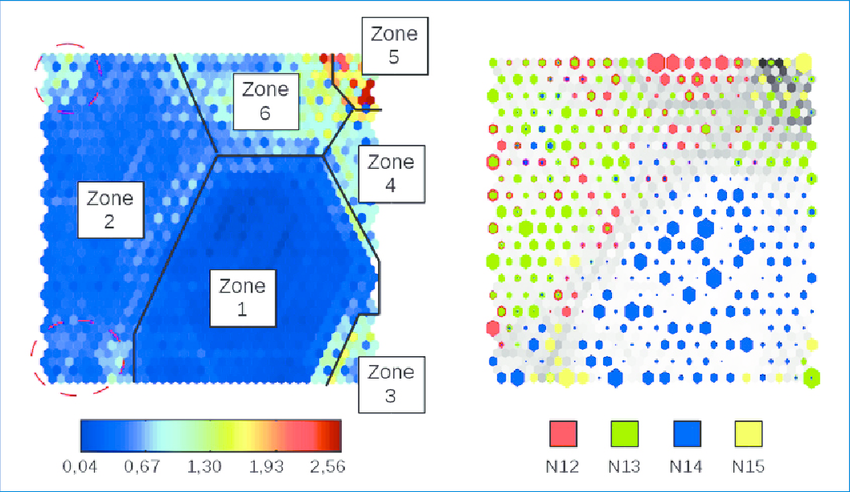

<body>
 
SOM algorithm is an unspervised artificial neural network for representation learning. The application of SOM is not limited to data visualization, and it is primarily used as a dimensionality reduction technique. 
The steps of the algorithm are the following 
Step 1: initialize random nodes with same dimensions as input data 
Step 2: randomly pick an input datapoint from the input data 
Step 3: iterate over all nodes, and calculate the distance(any distance metric) to the nodes and choose the node with the smallest distance as Best Matching Unit(BMU) 
Step 4: For all neigbouring points of BMU update the node weights with the following formula 
 
 
Let us introduce an example how SOM is able to achieve dimesionality reduction 
imagine having 5000 data points with 10 features. Then if we initalize a SOM with 500 nodes with 10 features each we will map 5000x10 datapoints into 500x10 dimensional map; thus achieving a dimensionality reduction of 10 times. 
SOM is also known for its kohonen map which is heatmap of distance matrix of the nodes. 
 
SOM clustering can be done by applying any clustering algorithm on the lower dimensional SOM representation, which makes it computationaly less expensive. 
SOM can also be combined with anomaly detection techniques for anomaly detection. 
For example the SOM can be combined with KNN where the distance between a point and k-nearest neighbors is calculated and used as measure for anomaly detection. 

</body>